<div align="center">


<br /><br />

# 🍔 RestroHub

**A premium cross-platform food delivery ecosystem built for speed, intelligence, and a delightful dining experience.**

Discover local flavors, chat with AI assistants, and track your orders in real-time — all powered by Flutter and Supabase.

[Features](#-features) · [Screenshots](#-screenshots) · [Architecture](#-architecture) · [Getting Started](#-getting-started) · [APK Download](APK_DOWNLOAD_GUIDE.md) · [License](#-license)

---

</div>

## 📖 Overview
RestroHub is a high-performance, feature-rich food delivery platform designed to provide a seamless and intelligent dining experience. More than just a simple delivery app, it represents a modern mobile engineering approach, blending Agentic AI with Real-Time Data Orchestration.

Built with a Feature-Driven Layered Architecture, RestroHub is designed for scale and reliability. It empowers users to discover local flavors through natural language conversation with Google Gemini, while ensuring a buttery-smooth UI even in low-connectivity environments through a custom Atomic Sync Engine.

---

## 📱 Screenshots

### 🔑 Onboarding & Discovery

|            Splash Screen            |          Login Screen          |                   Home Dashboard                    |
|:----------------------------------:|:--------------------------------:|:----------------------------------------------------:|
| 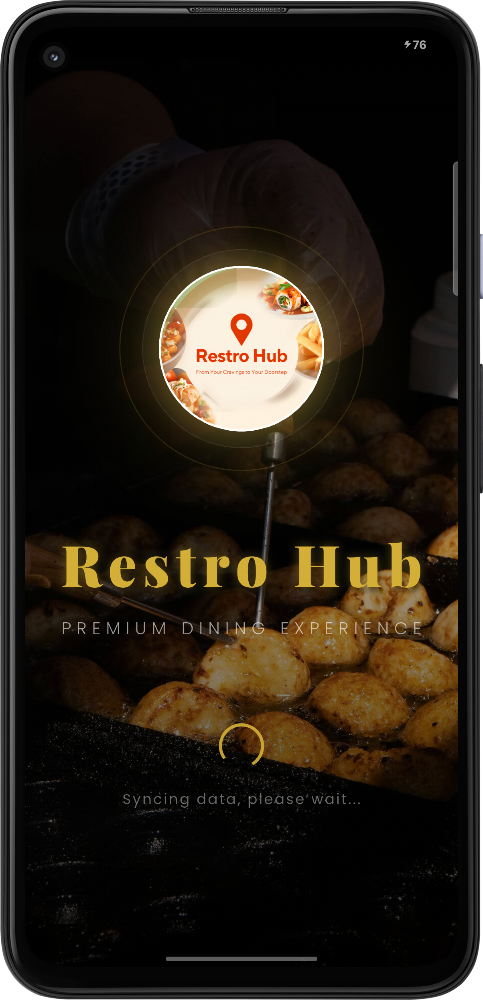 | 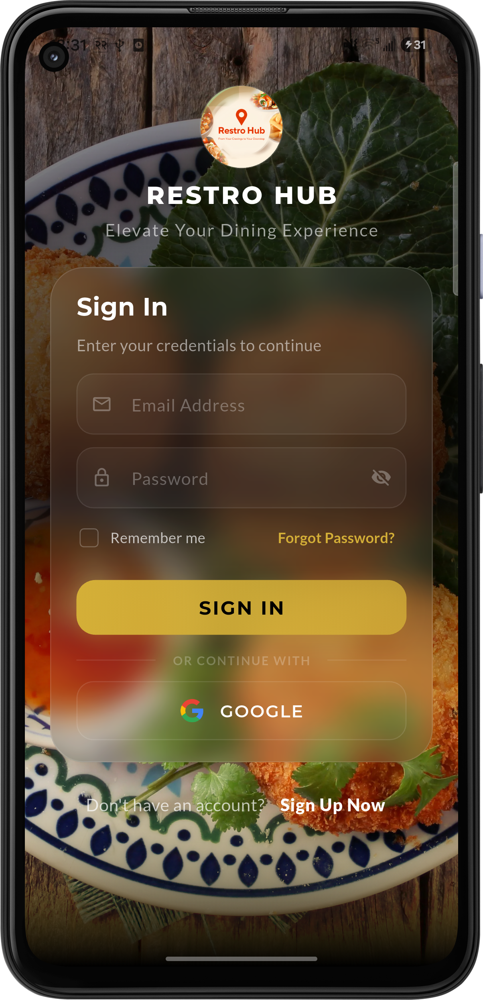 | 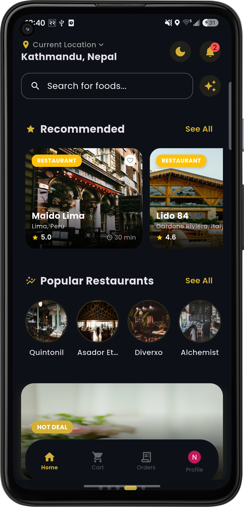 |

### 🤖 AI Assistant

|                 AI Initial Page                 |                 AI Search Results                  |
|:-----------------------------------------------:|:--------------------------------------------------:|
| 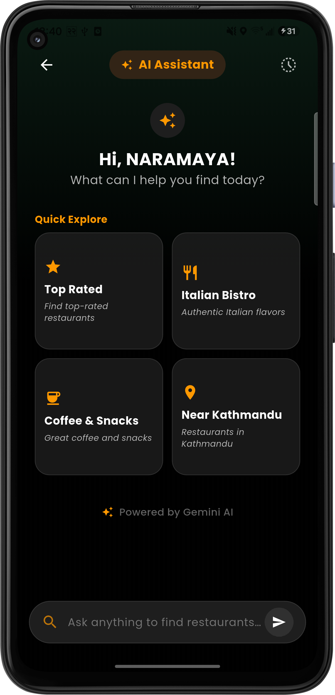 | 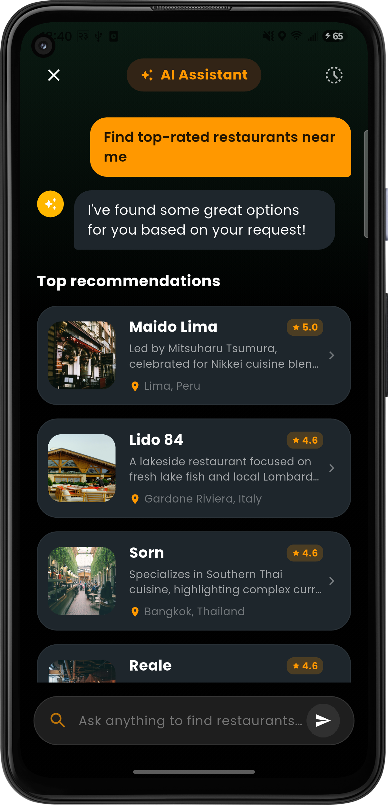 |

### 🍽️ Restaurant & 🍲 Food

|             Restaurant              |                 Food                  |                   
|:------------------------------------------:|:------------------------------:|
| 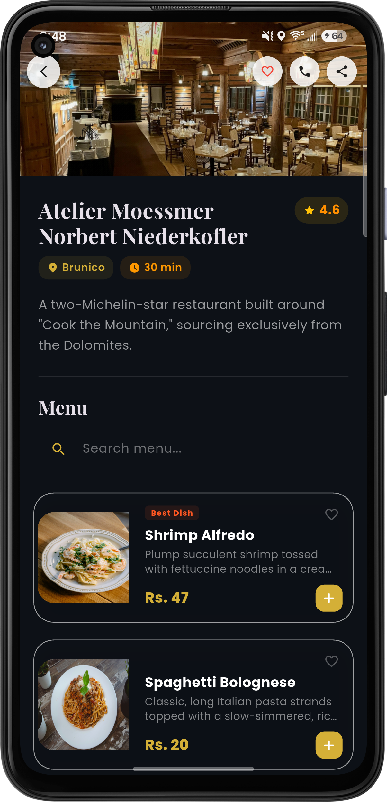 | 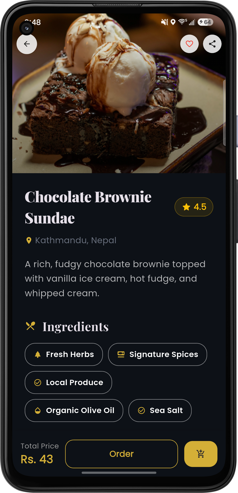 

### 🛒 Cart Flow

|             My Cart              |                 Review Order                  |      
|:--------------------------------:|:---------------------------------------------:|
| 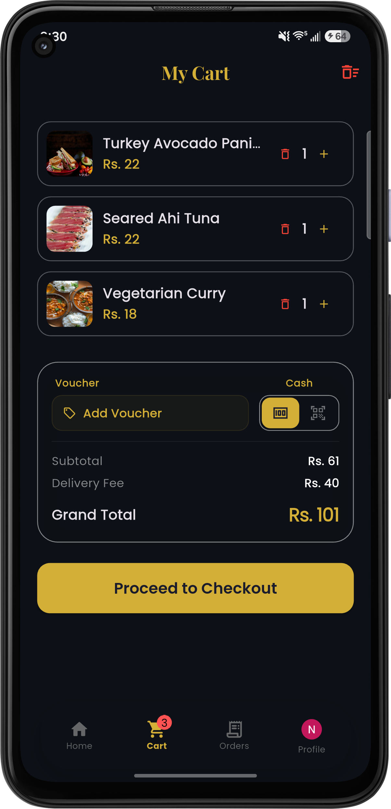 | 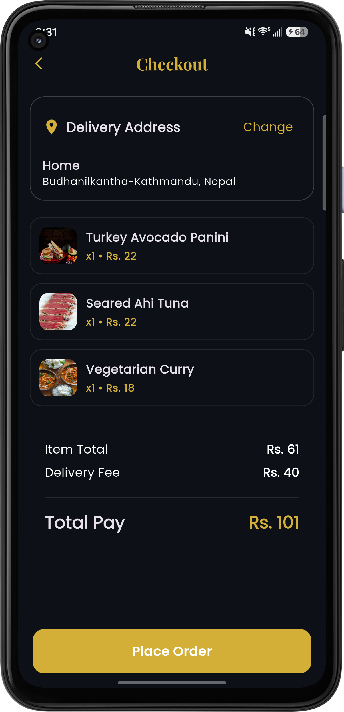 |

### 📦 Order Management

|                   Recent Orders                    |                     Live Tracking Order                      |                    Completed Orders                    |                         Cancelled Orders                          |
|:--------------------------------------------------:|:------------------------------------------------------------:|:-----------------------------------------------------:|:------------------------------------------------------------:|
| 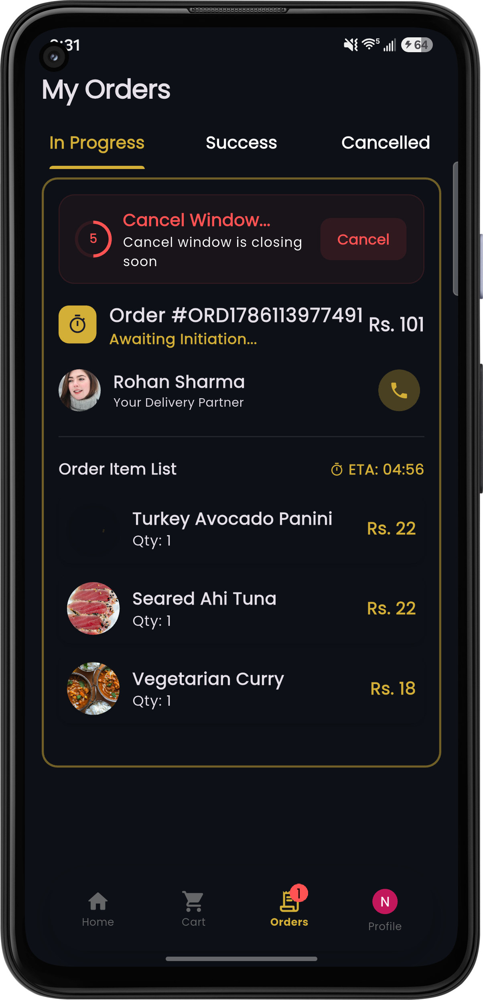 | 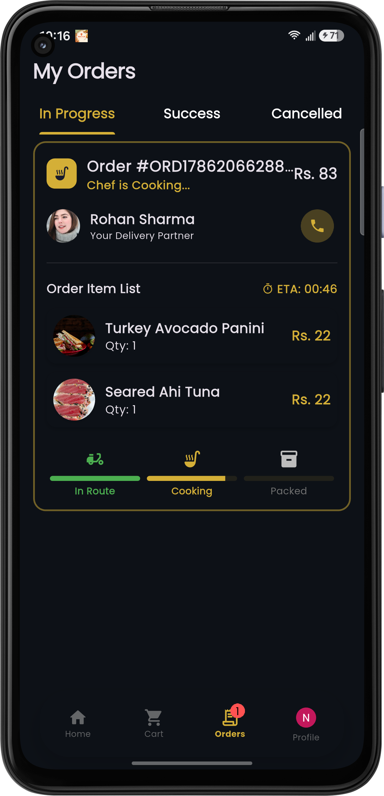 | 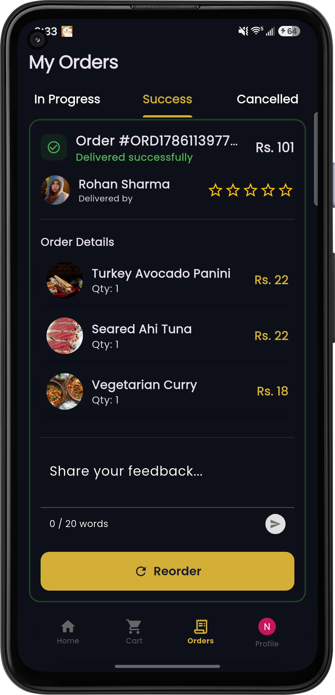 | 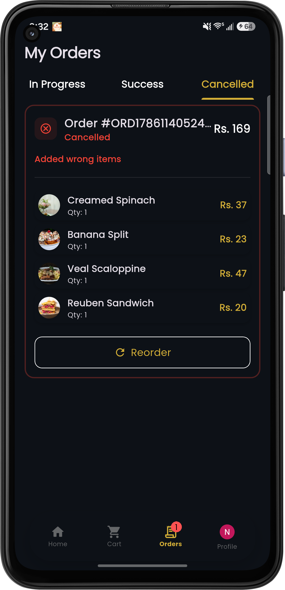 |

### 👤 Personalization

|              User Profile              |
|:--------------------------------------:|
| 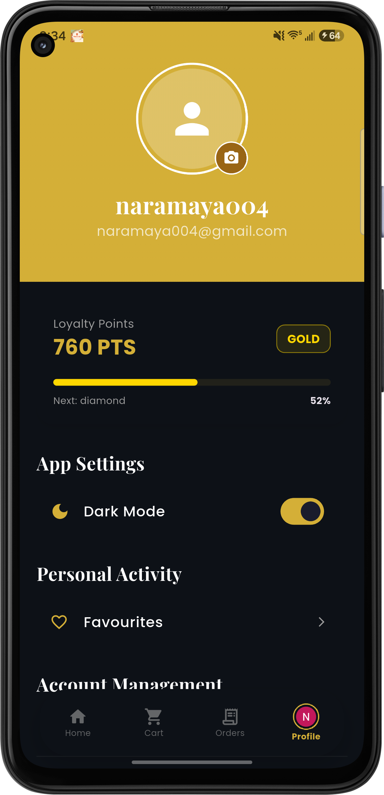 |

---

## ✨ Features

### 🤖 AI & Intelligence
- **Gemini AI Assistant** — Integrated via `google_generative_ai` to help users discover restaurants and dishes through natural language conversation.
- **Smart Recommendations** — Context-aware food suggestions based on user preferences and browsing history.
- **Conversational Search** — Find exactly what you're craving by just asking the built-in AI bot.

### 🍱 Restaurant & Catalog
- **Multi-Vendor Support** — Explore diverse cuisines from various restaurants with detailed menus and high-quality imagery.
- **Atomic Sync Engine** — Robust synchronization that uses atomic upserts to ensure the local database is always consistent without UI flickering.
- **Real-Time Updates** — Leveraging Supabase Realtime for instant menu updates, price changes, and availability.
- **Advanced Filtering** — Browse by cuisines, ratings, delivery time, and more.

### 📦 Order & Delivery
- **Live Order Tracking** — Real-time status updates from preparation to delivery using Supabase and local notifications.
- **Interactive Maps** — Precise location picking and delivery tracking powered by Google Maps SDK.
- **Order History** — Comprehensive view of previous orders with easy re-ordering functionality.

### ⚡ Performance & UX
- **Robust Offline-First** — Full cart and browsing capability even with flaky connections via Drift (SQLite) with atomic synchronization to prevent data loss.
- **Isolate-based Processing** — All heavy JSON parsing and data mapping are offloaded to background isolates to maintain a buttery-smooth 60/120 FPS UI.
- **Cross-Platform Excellence** — Unified codebase for Android, iOS, and Web with responsive design.
- **Local Network Sync** — Uses `bonsoir` (mDNS) and `shelf` for innovative local discovery and synchronization.

### 🔒 Security & DevOps
- **Hardened Security** — Integrated **Root/Jailbreak detection** and mandatory device integrity checks using `safe_device`.
- **Advanced Encryption** — Secure handling of sensitive data using **Strongbox (Android)** and **Secure Enclave (iOS)** via `flutter_secure_storage`.
- **SSL Pinning** — Mitigates MITM attacks by enforcing certificate pinning on all network requests.
- **CI/CD Pipeline** — Automated testing, static analysis, and multi-platform build verification powered by **GitHub Actions** with an optimized caching system.
- **Code Obfuscation** — Production builds are hardened with R8/Proguard obfuscation to prevent reverse engineering.

---

## 🏗 System Architecture

RestroHub follows a **Feature-Driven Layered Architecture**, strictly adhering to Unidirectional Data Flow (UDF) principles.

### Architecture Overview

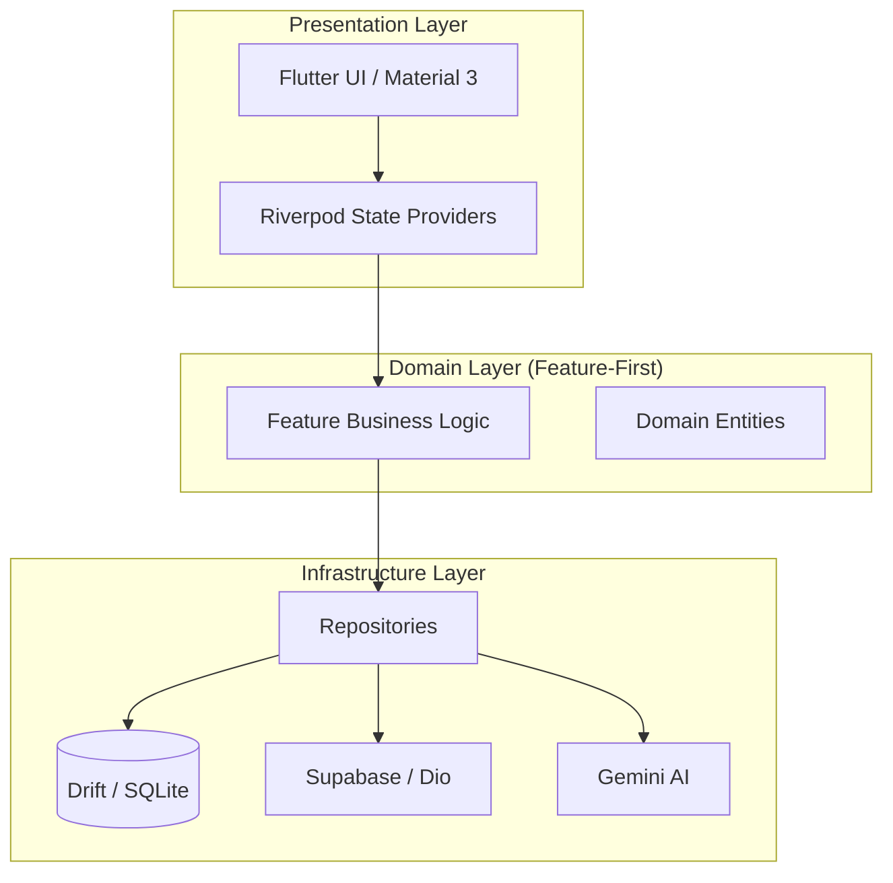

## 🏗️ Architecture

RestroHub follows a **Feature-Driven Layered Architecture**, ensuring high maintainability and scalability.

```
lib/
├── core/                # Cross-cutting concerns (Theme, Utils, Constants)
├── features/            # Business logic and UI grouped by feature
│   ├── ai/              # Gemini AI integration
│   ├── auth/            # Authentication & User Profile
│   ├── cart/            # Cart management logic
│   ├── orders/          # Order placement and tracking
│   └── restaurants/     # Restaurant discovery and menus
├── infrastructure/      # Data sources, repositories, and DTOs
├── router/              # Navigation configuration (GoRouter)
└── main.dart            # Application entry point
```

---

## 🛠 Tech Stack

| Layer              | Technology                                                        |
|--------------------|-------------------------------------------------------------------|
| **Framework & UI** | Flutter (3.10.4+), Material 3, Google Fonts, Animations           |
| **Architecture**   | Feature-Driven Architecture, Riverpod (UDF), GoRouter             |
| **AI / ML**        | Google Generative AI (Gemini), Gemini Function Calling.           |
| **Backend & Sync** | Supabase (Auth, Postgres, Realtime, Storage), Dio                 |
| **Security**       | Safe Device (Root/Jailbreak), Flutter Secure Storage, SSL Pinning |
| **Local Data**     | Drift (SQLite), Shared Preferences                                |
| **DevOps**         | GitHub Actions (CI/CD), R8/Proguard Obfuscation                   |
| **Utility**        | Bonsoir (mDNS), Shelf (Web Server), Connectivity Plus             |

---

### Prerequisites
- [Flutter SDK](https://docs.flutter.dev/get-started/install) (>= 3.10.4)
- [Supabase Project](https://supabase.com/)
- [Google Gemini API Key](https://ai.google.dev/)

### Installation

> [!TIP]
> **Looking for a pre-built version?** Check out the [APK Download & Installation Guide](APK_DOWNLOAD_GUIDE.md) for quick setup on your Android device without compiling the source code.

1. **Clone the repository**
   ```bash
   git clone https://github.com/milan-ghimire/RestroHub.git
   ```

2. **Setup Environment**
   Create a `.env` file in the root directory based on `.env.example`:
   ```properties
   SUPABASE_URL="your_supabase_url"
   SUPABASE_ANON_KEY="your_supabase_anon_key"
   GEMINI_API_KEY="your_gemini_api_key"
   ```

3. **Install Dependencies**
   ```bash
   flutter pub get
   ```

4. **Run Code Generation**
   ```bash
   flutter pub run build_runner build --delete-conflicting-outputs
   ```

5. **Launch Application**
   ```bash
   flutter run --android-skip-build-dependency-validation
   ```

> [!NOTE]
> If you encounter Android dependency validation errors during build or run (common with newer AGP versions), the project uses the `--android-skip-build-dependency-validation` flag to bypass these checks.

---

## 📄 License

Copyright 2025 Milan Ghimire

Licensed under the Apache License, Version 2.0 (the "License");
you may not use this file except in compliance with the License.
You may obtain a copy of the License at

    http://www.apache.org/licenses/LICENSE-2.0

Unless required by applicable law or agreed to in writing, software
distributed under the License is distributed on an "AS IS" BASIS,
WITHOUT WARRANTIES OR CONDITIONS OF ANY KIND, either express or implied.
See the License for the specific language governing permissions and
limitations under the License.

---

<div align="center">

Built with ❤️ by **Milan Ghimire**

</div>
